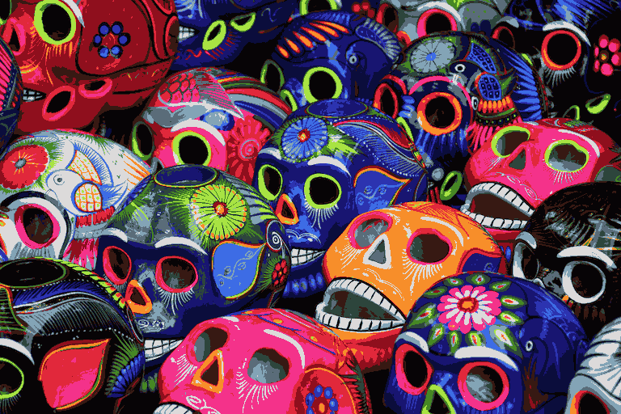

# quantette

`quantette` is a library for fast and high quality image quantization and palette generation.
It supports the sRGB color space for fast color quantization but also the CIELAB and Oklab
color spaces for more accurate quantization. Similarly, `quantette`'s k-means color quantizer
gives high quality results while the included Wu color quantizer gives fast but still quite good results.

In some critical locations, `quantette` makes use of SIMD
(via the [`wide`](https://crates.io/crates/wide) crate).
Consider enabling the `avx` or `avx2`
[target features](https://doc.rust-lang.org/reference/conditional-compilation.html#target_feature)
for a noticeable speed up if your target architecture supports these features.
If the `threads` cargo feature is enabled, multi-threaded versions of most functions
become available for even greater speed up.

# Examples

Below are some examples of `quantette` in action.
The dissimilarity between the each image and the original is reported in the tables below
using [`dssim`](https://crates.io/crates/dssim) (lower numbers are better).
Each table starts with output from GIMP as a comparison.

Each output image was created like so:
- The GIMP output was creating using `Image > Mode > Indexed` with GIMP version `2.10.34`.
- The `Wu - sRGB` output was creating using `quantette`'s fastest quantization method.
  The default number of bins was used (`32`).
- The `K-means - Oklab` output was creating using `quantette`'s most accurate quantization method.
  A sampling factor of `0.5` and a batch size of `4096` was used.

All output images are undithered to better highlight differences.

## Original Image

## 16 Colors

| Method          | DSSIM      | Result                        |
| --------------- | ---------- | ----------------------------- |
| Gimp            | 0.06368717 |          |
| Wu - sRGB       | 0.04014392 |       |
| K-means - Oklab | 0.02632949 |  |

## 64 Colors

| Method          | DSSIM      | Result                        |
| --------------- | ---------- | ----------------------------- |
| Gimp            | 0.01730340 |          |
| Wu - sRGB       | 0.01256557 |       |
| K-means - Oklab | 0.00638550 |  |

## 256 Colors

| Method          | DSSIM      | Result                         |
| --------------- | ---------- | ------------------------------ |
| Gimp            | 0.00488789 |          |
| Wu - sRGB       | 0.00330477 |       |
| K-means - Oklab | 0.00160596 |  |

# Benchmarks and Comparison

Below are some comparisons between `quantette` and some other libraries.
These should be taken with a grain of salt, as each library has different
situations and/or options that can make then perform better or worse.
These are meant to give a rough point of reference.
Note that `quantette` currently doesn't support alpha channel/component, while the other libraries do.

- `Wu - Srgb` and `K-means - Oklab` refer to the same settings/methods described above in [examples](#Examples).
- `imagequant` version `4.2.2` was run using the default library options (quality of `100`).
- `color_quant` version `1.1.0` was run with a `sample_frac` of `10`.
- `exoquant` version `0.2.0` was run without k-means optimization, since it would otherwise take too long.

The results below are for 256 colors. Additionally, all results are without dither,
since `color_quant` doesn't have dithering.

## Time

"Time" refers to the total time, in milliseconds, for quantization and remapping
as reported by the `simplecli` binary with the `--verbose` flag.
The binary in question can be found in `examples/`. 30 trials were run and averaged for each data point.
The `Wu - Srgb`, `K-means - Oklab`, and `imagequant` columns used 4 threads,
while `color_quant` and `exoquant` only support single-threaded execution.
So, multiply or divide by 4 as you see fit.

| Image                  | Width | Height | Wu - Srgb | K-means - Oklab | imagequant | color_quant | exoquant |
| ---------------------- | ----- | ------ | --------- | --------------- | ---------- | ----------- | -------- |
| Akihabara.jpg          | 5663  | 3769   | 36        | 266             | 1492       | 3477        | 8672     |
| Boothbay.jpg           | 6720  | 4480   | 49        | 261             | 1106       | 4514        | 7738     |
| Hokkaido.jpg           | 6000  | 4000   | 39        | 205             | 776        | 3321        | 5844     |
| Jewel Changi.jpg       | 6000  | 4000   | 41        | 166             | 652        | 2932        | 4915     |
| Louvre.jpg             | 6056  | 4000   | 41        | 182             | 723        | 3701        | 5525     |

## Accuracy/DSSIM

The results below are DSSIM values as reported by the `accuracy` binary found in `examples/`.
Note that `exoquant` results are not deterministic, since it uses `rand::random()`.

| Image                  | Width | Height | Wu - Srgb  | K-means - Oklab | imagequant | color_quant | exoquant   |
| ---------------------- | ----- | ------ | ---------- | --------------- | ---------- | ----------- | ---------- |
| Akihabara.jpg          | 5663  | 3769   | 0.00762276 | 0.00388072      | 0.00432195 | 0.00749248  | 0.00583372 |
| Boothbay.jpg           | 6720  | 4480   | 0.00437625 | 0.00226944      | 0.00242491 | 0.00585143  | 0.00345061 |
| Hokkaido.jpg           | 6000  | 4000   | 0.00339461 | 0.00157206      | 0.00172781 | 0.00325078  | 0.00382358 |
| Jewel Changi.jpg       | 6000  | 4000   | 0.00159665 | 0.00074988      | 0.00076888 | 0.00156673  | 0.00102799 |
| Louvre.jpg             | 6056  | 4000   | 0.00305672 | 0.00143401      | 0.00156126 | 0.00348470  | 0.00244134 |

# License

`quantette` is licensed under either
- the [Apache License, Version 2.0](https://www.apache.org/licenses/LICENSE-2.0) (see [LICENSE-APACHE](LICENSE-APACHE))
- the [MIT](http://opensource.org/licenses/MIT) license (see [LICENSE-MIT](LICENSE-MIT))

at your option.
