# Examples

Below are some examples of `quantette` in action. The dissimilarity between the each image and the original is reported in the tables below using [`dssim`](https://crates.io/crates/dssim) (lower numbers are better). Each table starts with output from GIMP as a comparison.

Each output image was created like so:
- The GIMP output was creating using `Image > Mode > Indexed` with GIMP version `2.10.36`. For dithered outputs, `Floyd-Steinberg (reduced color bleeding)` was used.
- The `Wu (sRGB)` output was creating using `quantette`'s fastest quantization method. The default number of bins was used. This method does not easily support dithering and is omitted from the dithering section below.
- The `Wu (Oklab)` output is similar to the above but performed in the Oklab color space. It serves as an example mix between speed and accuracy. It also supports dithering. The default number of bins was used.
- The `k-means` output was creating using `quantette`'s most accurate quantization method running in the Oklab color space. The default `KmeansOptions` were used.

# Original Image

# Without Dithering

## 16 Colors

| Method     | DSSIM    | Result                   |
| ---------- | -------- | ------------------------ |
| Gimp       | 0.063687 | 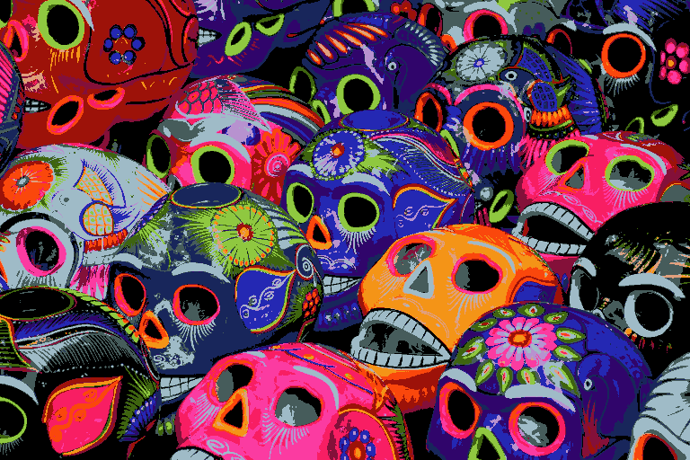     |
| Wu (sRGB)  | 0.042151 | 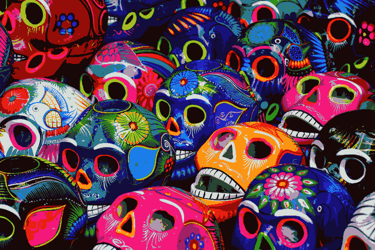  |
| Wu (Oklab) | 0.038925 | 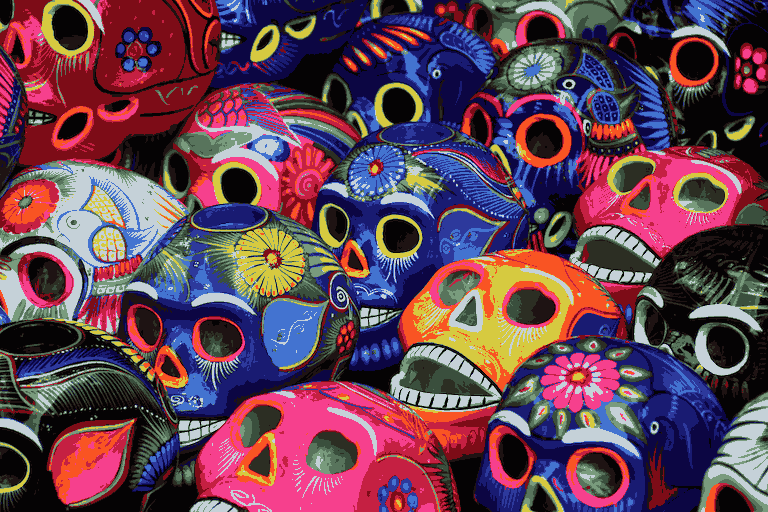 |
| k-means    | 0.02628  | 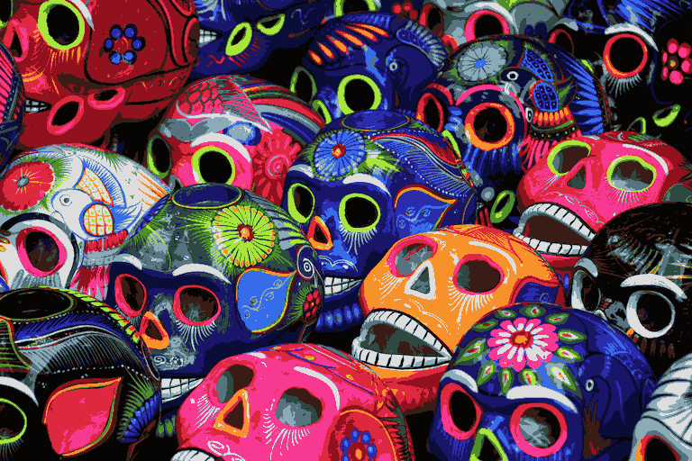   |

## 64 Colors

| Method     | DSSIM    | Result                   |
| ---------- | -------- | ------------------------ |
| Gimp       | 0.017303 |      |
| Wu (sRGB)  | 0.013167 | 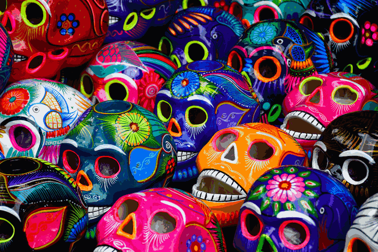  |
| Wu (Oklab) | 0.007939 | 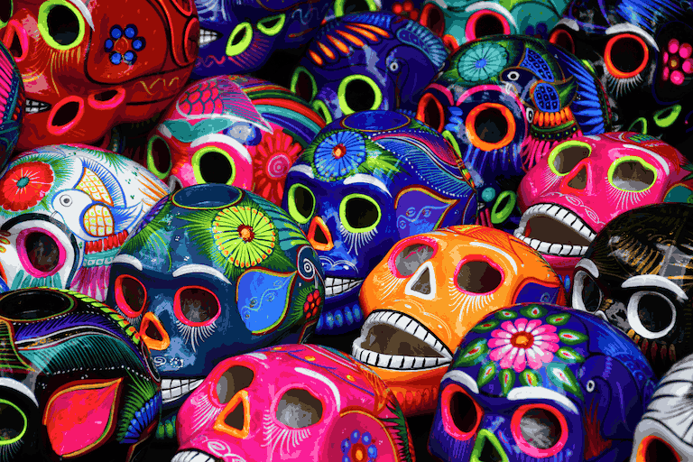 |
| k-means    | 0.006328 |    |

## 256 Colors

| Method     | DSSIM    | Result                    |
| ---------- | -------- | ------------------------- |
| Gimp       | 0.004888 |      |
| Wu (sRGB)  | 0.003432 | 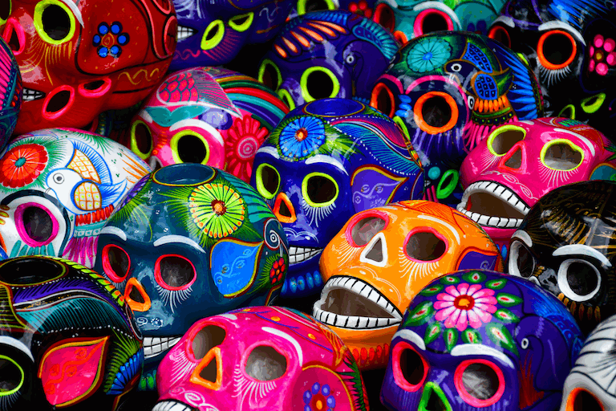  |
| Wu (Oklab) | 0.002093 |  |
| k-means    | 0.00155  | 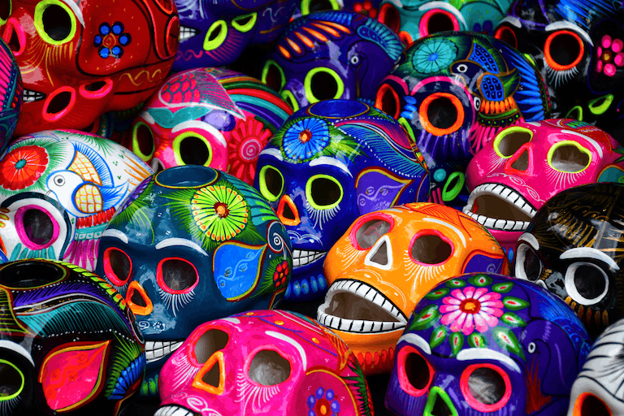   |

# With Dithering

## 16 Colors

| Method     | DSSIM    | Result                          |
| ---------- | -------- | ------------------------------- |
| Gimp       | 0.050564 | 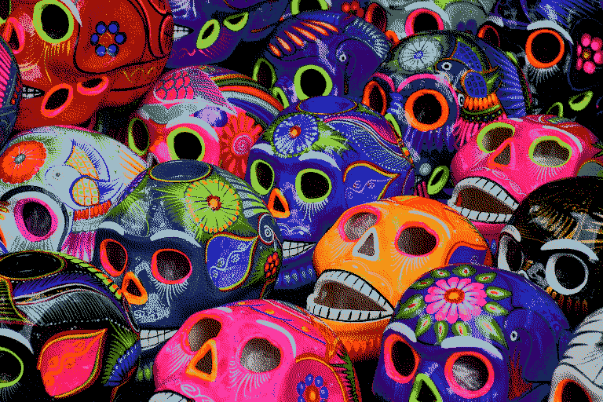     |
| Wu (Oklab) | 0.027656 | 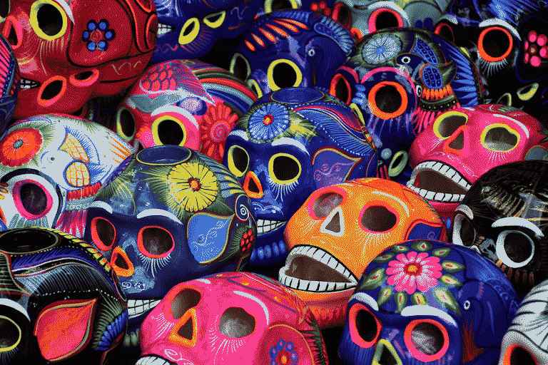 |
| k-means    | 0.018208 |    |

## 64 Colors

| Method     | DSSIM   | Result                          |
| ---------- | ------- | ------------------------------- |
| Gimp       | 0.01366 |      |
| Wu (Oklab) | 0.0052  |  |
| k-means    | 0.00424 | 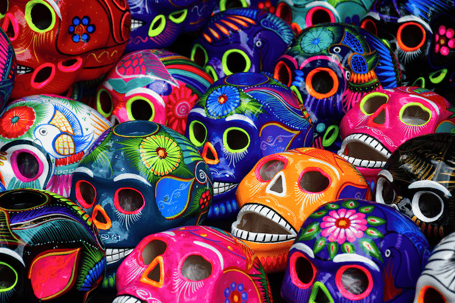   |

## 256 Colors

| Method     | DSSIM    | Result                           |
| ---------- | -------- | -------------------------------- |
| Gimp       | 0.004073 |      |
| Wu (Oklab) | 0.001417 |  |
| k-means    | 0.001061 |    |
